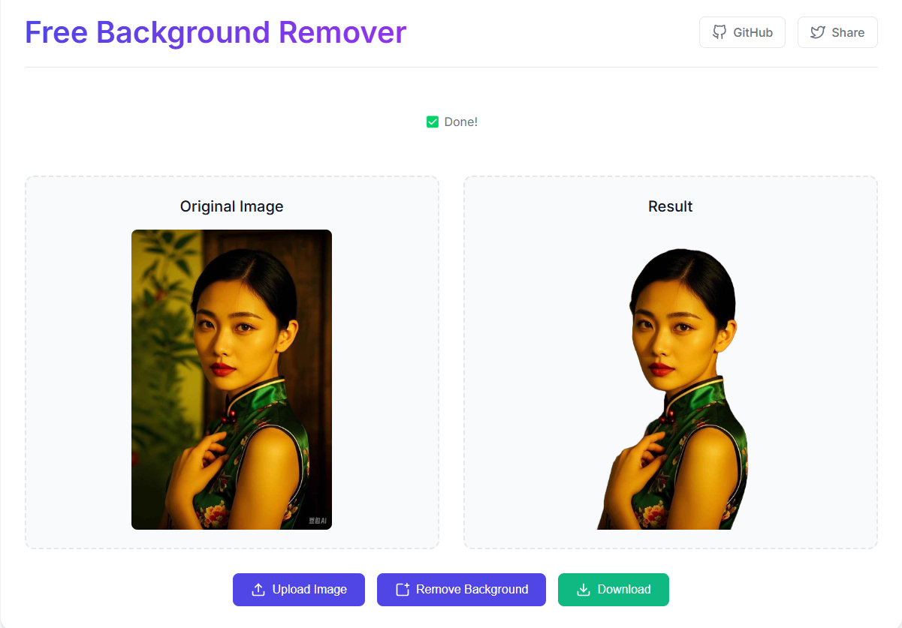

# 🎯 Remove Background

🌟 Remove image backgrounds in your browser using AI - no signup required!



## ✨ Features

- Process images directly in your browser
- Privacy-first: no server uploads needed
- Fast processing with GPU acceleration
- Automatic caching for better performance
- Mobile-friendly responsive design

## 🛠️ Technology

- Powered by Hugging Face Transformers.js
- RMBG-1.4 AI Model
- Service Worker for offline support
- Browser caching for faster loading

## 🚀 Getting Started

1. Open the website
2. Upload your image
3. Click "Remove Background"
4. Download the result

## 💻 Development

```bash
# Clone the repository
git clone https://github.com/shalom-lab/remove-background.git

# Navigate to the project directory
cd remove-background

# Serve with any static file server
# For example, using Python:
python -m http.server 8000
```

## 🌟 Credits

- [Hugging Face](https://huggingface.co/) for the Transformers.js library
- [RMBG-1.4](https://huggingface.co/briaai/RMBG-1.4) model by BriaAI

## 📄 License

MIT License - feel free to use and modify! 